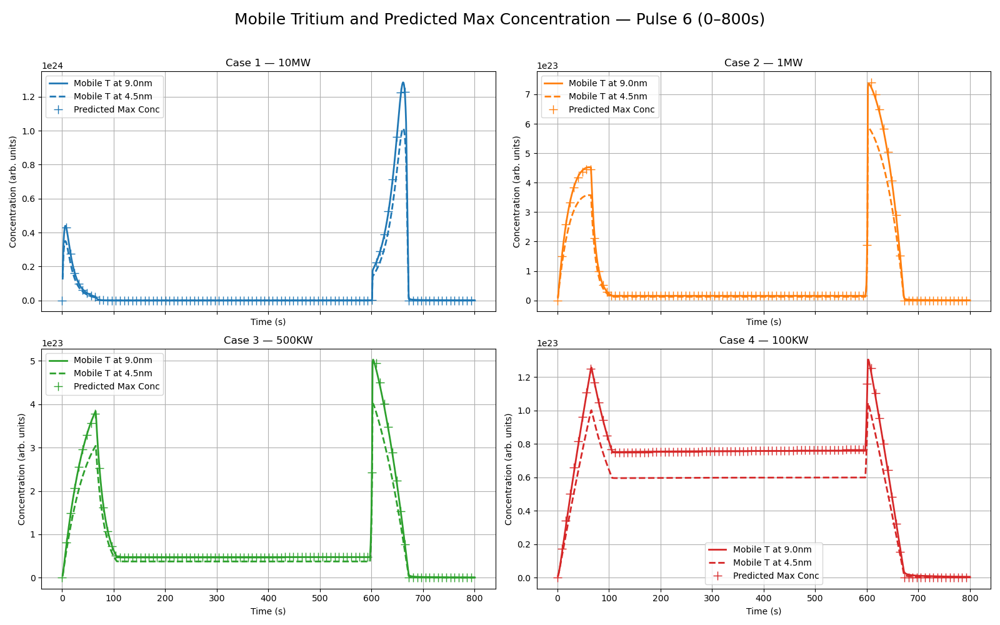

·   **Run simulations inputting surface mobile concentration as a BC. This BC serves as an approximation to gaussian implantation fluxes .**

o   Progress: Done

o   Comments: We can approximation plasma implantation fluxes by imposing a Dirichlet BC in the concentration of mobile species at the inlet surface as the material, given by the formula:

 $c_m = \frac{\phi_{imp} R_p}{D}+\sqrt{\frac{\phi_{imp}}{K_r}} \approx c_m = \frac{\phi_{imp} R_p}{D}$ , 

[Theory — FESTIM Documentation](https://festim.readthedocs.io/en/latest/theory.html#plasma-implantation-approximation)

where $c_m$ is the concentration of mobile H at the surface, $\phi_{imp}$ is the implantation flux, $R_p$ the implantation depth, $D$ the diffusion coefficient and $K_r$ the recombination coefficient. Last approximation is obtained when recombination is fast ($K_r \to \infty$) and is assumed in our model.

After implementing this new BC, simulation efficiency was significantly improved yielding similar results as before:

The analytical equation reproduced exactly the maximum concentration of mobile species near the surface for different heat loads and power profiles. Note that when simulating an implantation flux and a surface recombination BC, the maximum mobile concentration was attained at about $9nm$ or approximately $2R_p$ .

After checking the validity of the approximation in our cases, 100 consecutive simulations consisting of an ~800s pulse followed by roughly 100,000s of waiting time were ran, with and without the implementation of the implantation approximation. Then, pre-bulk and bulk inventories and build-ups over time were compared and show little relative discrepancies:

![[inventory_comparison_case_1MW.png]]

![[inventory_comparison_case_10MW.png]]

![[inventory_comparison_case_100KW.png]]

![[inventory_comparison_case_500KW.png]]
