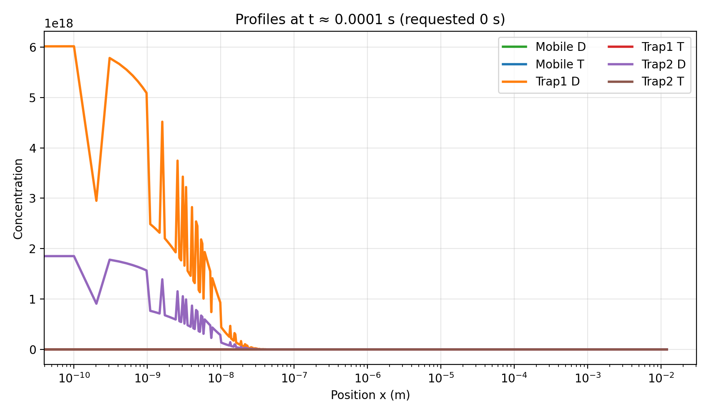

·   **Run simulations with time dependent temperature profiles (and lower heat loads than 10MW/m^2) and check validity of the results**

o   Progress: Done 

o   Comments: Simulations of scenarios with lower heat loads ($1\,MW/m^2$, $0.5\,MW/m^2$ and $0.1\,MW/m^2$) have been run successfully. Counterintuitively, imposing smaller tolerances resulted in the simulations being run successfully (my guess is that this way we prevent diverging solutions from being accepted, which was later causing the next calculations not to converge.

