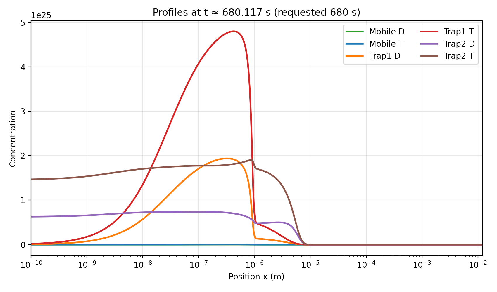
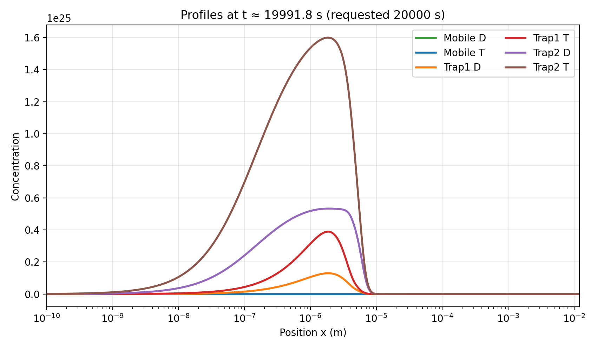

·   **The function to export XDMF files is raising errors when trying to export concentrations of trapped species.**

o   Progress: Done

o   Comments: The XDMFExport function of FESTIM-2 was working well for mobile species but raising errors for trapped species. It turns out this issue was related to the fact that trapped species use a basis of Discontinuous Galerkin elements "DG" instead of continuous ones "CG".

I posted the issue in the festim discourse group and the issue has been resolved by showing me how to manually set trapped elements to "CG". The issue will be solved in the future and when a PR is opened  notification will be posted in the thread.

https://festim.discourse.group/t/issues-with-advection-term-and-xdmf-export/145/6

After implementing the solution, I am finally able to correctly process and visualize concentration profiles of all mobile and trapped species.

.png)
We can now easily check whether the simulation is running correctly during the waiting time or iterating without actually solving the equations and keeping constant concentrations.

Next step will be use this in order to test the restart function that I had already implemented.