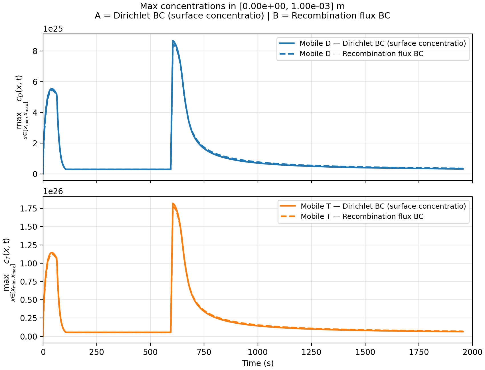
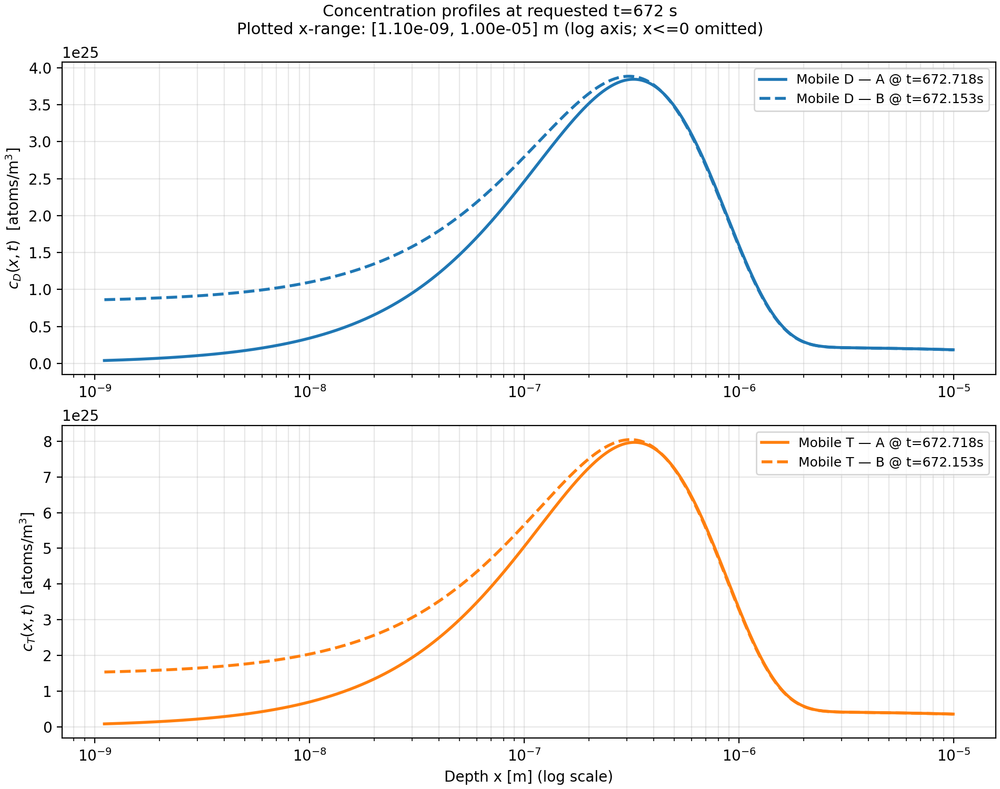
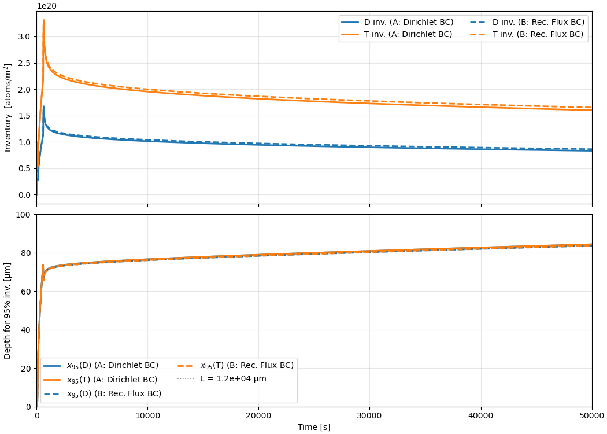
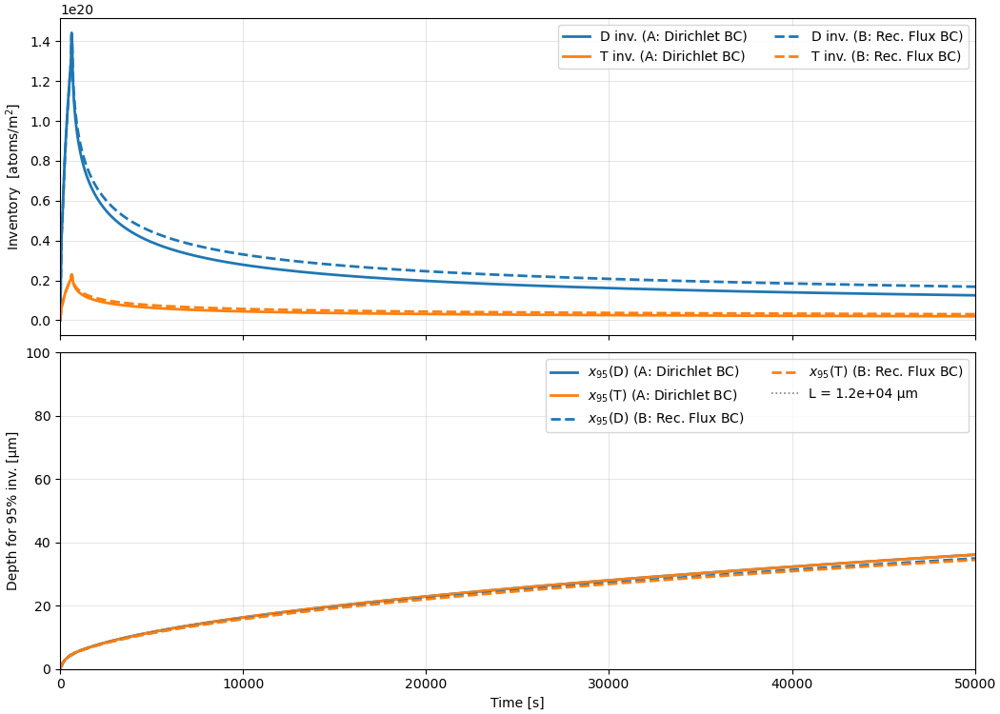
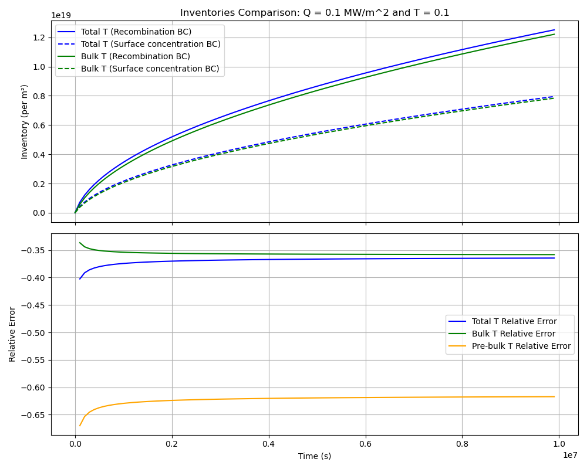
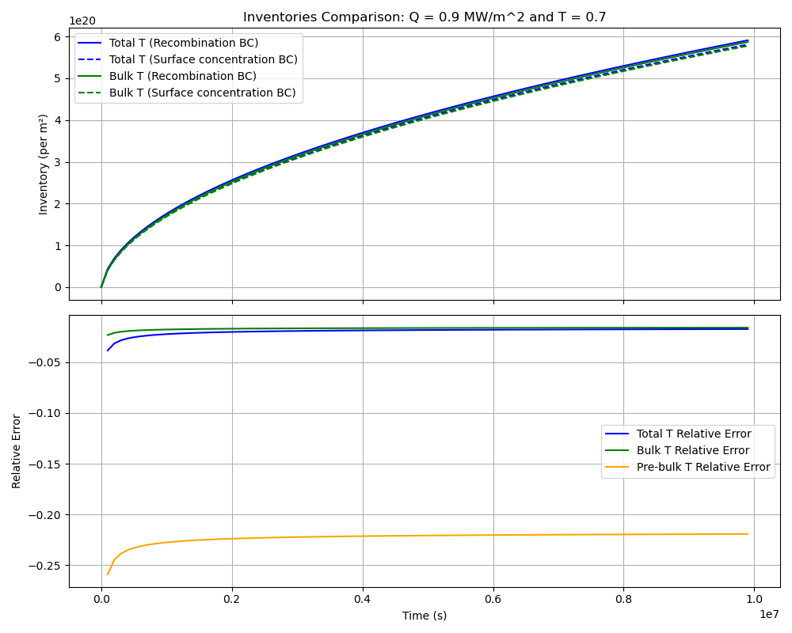
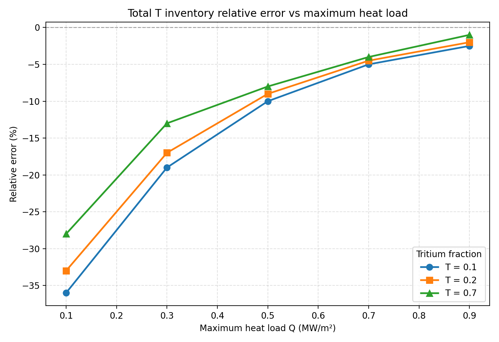
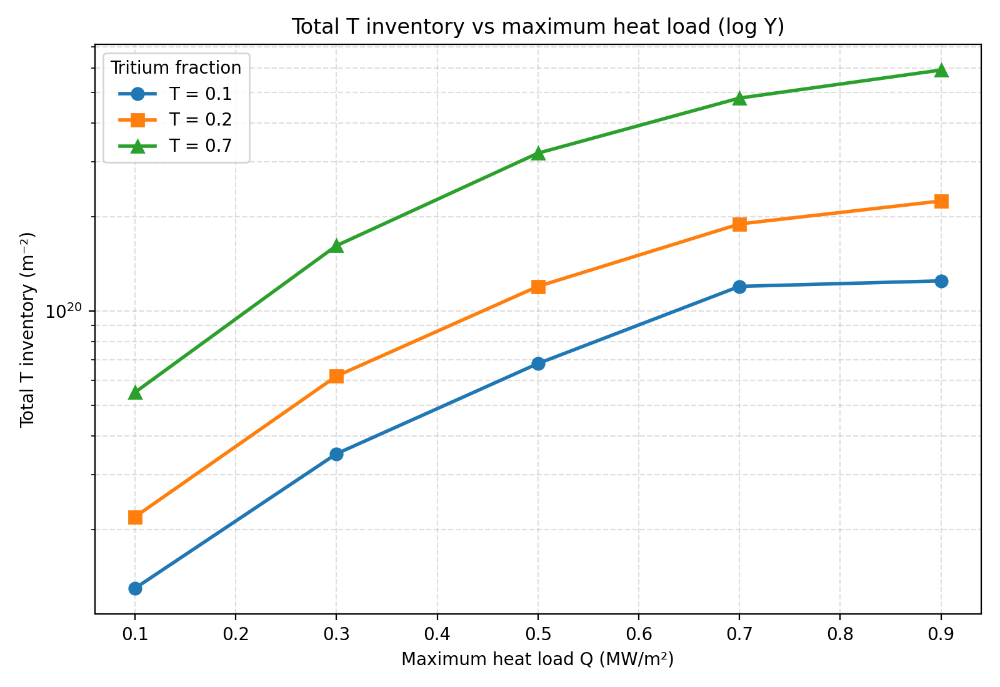
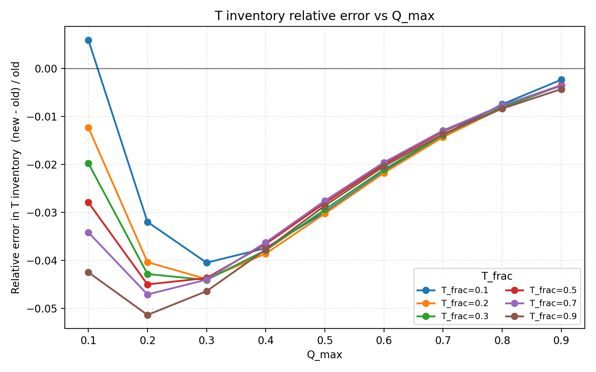

o   Progress: Done

o   Comments: After validating our analytical equations for both the surface and the maximum mobile species concentrations, we implemented the new Dirichlet BC ( imposing the mobile concentrations at the surface to be equal to our analytical $c_{m,D},c_{m,T}$ ), we ran simulations of 100,000 s (including 672 s of pulse time plus the additional ~99,000 s of waiting time) and compared the new results to those obtained with the original recombination flux BC.

The main concern of the implementation of the new BC is that, once the pulse finishes, the mobile concentrations at the surface are being set to zero (according to our analytical formula, which is valid only during Hydrogen implantation). Therefore, the we are artificially increasing the gradient of the mobile concentration in the surface, and overestimating the outwards flux, which could lead to high errors in the total hydrogen inventory and diffusion into the bulk.

**Results**

These results correspond to simulations run with maximum heat loads $Q_{max} = 0.9 MW/m^2$ and a Tritium fraction in the plasma of $T_{frac} = 0.7$. 

We can see how the new BC reproduces very well the maximum concentration of the mobile species, even during the waiting time in which the surface concentrations were set to zero.

However, as we discussed before, right after the pulse, the mobile species gradient near the surfaces is artificially increased:

And this leads to lower inventories:

In this case however, the D and T inventories are underestimated only by a $3\%$ and a $4\%$ respectively. The bottom plot shows the evolution with time of the depth at which the accumulated inventory equals $95\%$ of the total (expressed in $\mu m$). It serves as an approximation of the diffusion depth.  

In other cases, in which the maximum mobile concentration is lower after the pulse, the relative increment in the outwards flux is way higher and leads to bigger discrepancies:

These results correspond to simulations with maximum heat load $Q_{max} = 0.1 MW/m^2$ and a Tritium fraction in the plasma of $T_{frac} = 0.1$.  The discrepancies in final D and T inventories were $25\%$ and $32\%$ respectively.

This case involving low heat-loads, and therefore almost constant value of the diffusion coefficient $D(T)=D_0e^{\frac{-E_D}{k_BT}}$ , depicts the expect behavior of the diffusion depth over time $x_D\propto\sqrt{t}$

**Conclusions and next steps**

It still remains to study how do these discrepancies change in the long-term. However, notice that for the cases with the highest inventories, these discrepancies will be smaller, since the relative alteration in the gradient of mobile concentration will be smaller. 

One way to solve this discrepancies would be to study how does the surface concentration evolve in the simulations with the recombination flux BC, and try to come up with an analytical expression for it which can be later added as a Dirichlet BC during the waiting time, instead of just letting $c_{s,D},c_{s,T}$ be zero.

Finally I would like to remark that this issue was not present in the Tungsten simulations as those cases involve much faster recombination, and the assumption that $c_{s,D},c_{s,T}=0$ is good enough.

**Long-term inventory comparison**

I ran 100 concatenated simulations of ~600 s of flat-top plasma pulse followed by roughly 100,000 s of waiting time for 15 different cases in SS316L (combinations of different powers and tritium fractions in the plasma). These simulations were run with the new BC in which we set the surface mobile concentrations to the maximum concentration given by our analytical equation (see [Progress-tracker/Tritium inventory in PFC/Theory, models/Concentration BCs for slow recombination and multi-isotopes - Corrected version.md at main · AdriaLlealS/Progress-tracker](https://github.com/AdriaLlealS/Progress-tracker/blob/main/Tritium%20inventory%20in%20PFC/Theory%2C%20models/Concentration%20BCs%20for%20slow%20recombination%20and%20multi-isotopes%20-%20Corrected%20version.md)) and also with the old recombination flux BC, which should give the most realistic results. 

Here we can be the results for the best and the worst scenario, in terms of the relative error of the new BC simulations with respect to the old recombination flux BC:

Following the previous explanation, in which we state that the discrepancy in Tritium inventories is mainly due to the unrealistic assumption that the surface concentrations of mobile species drop to zero after the pulse, we would expect the relative errors to be higher for the cases in which we have lower values of the maximum T mobile concentration at 672 s. Here is a summary of the relative errors in Tritium inventory after the 100 consecutive pulses, as a function of $Q_{max}$ and for different Tritium fractions in the plasma $T_{frac}$:

Similarly, for the total Tritium inventories as a function of $Q_{max}$ and $T_{frac}$, we obtained the following results with the Recombination BC, which were used as reference for the relative errors:

In order to mitigate this huge discrepancies,
