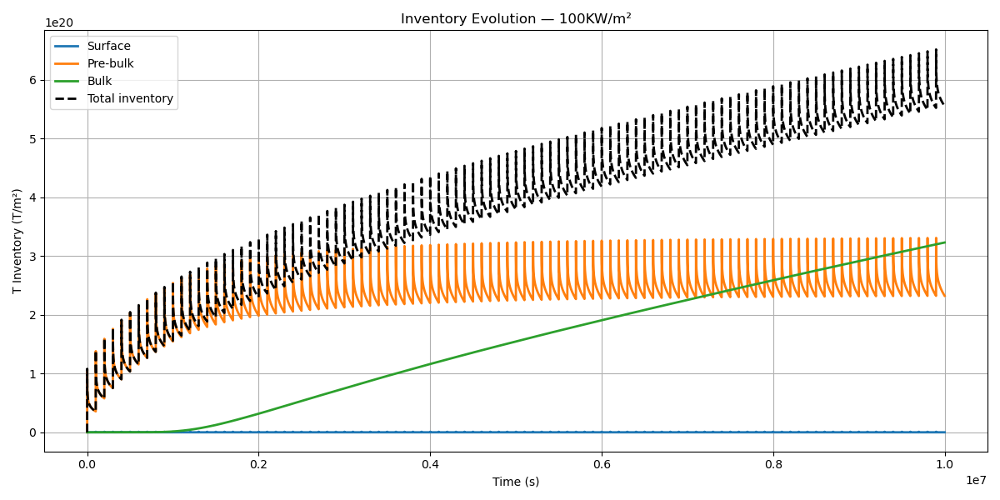
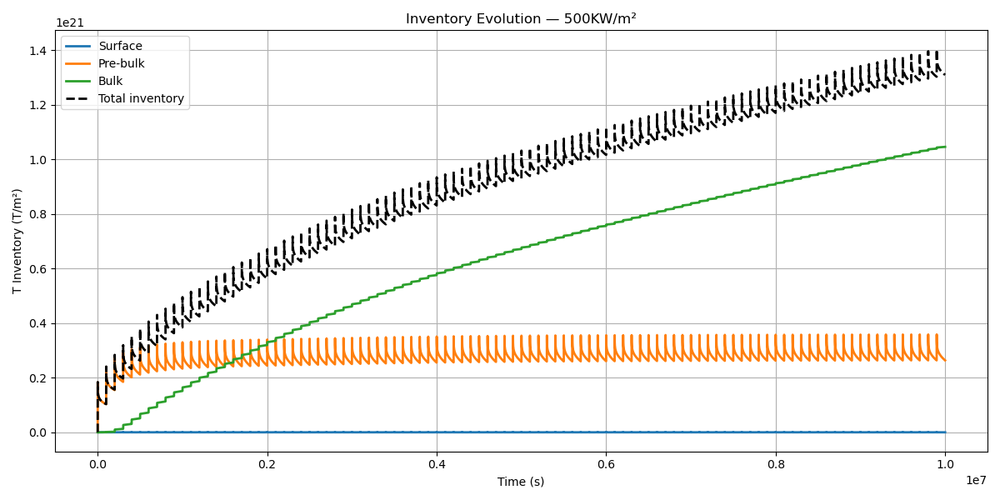
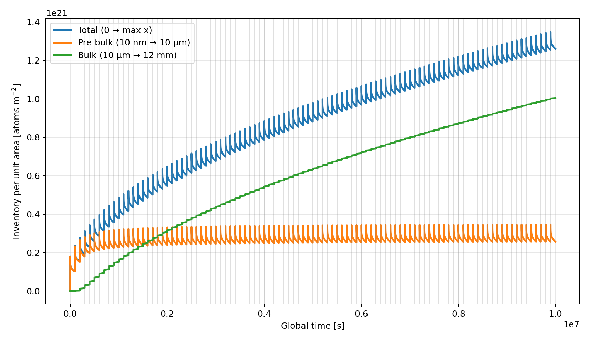
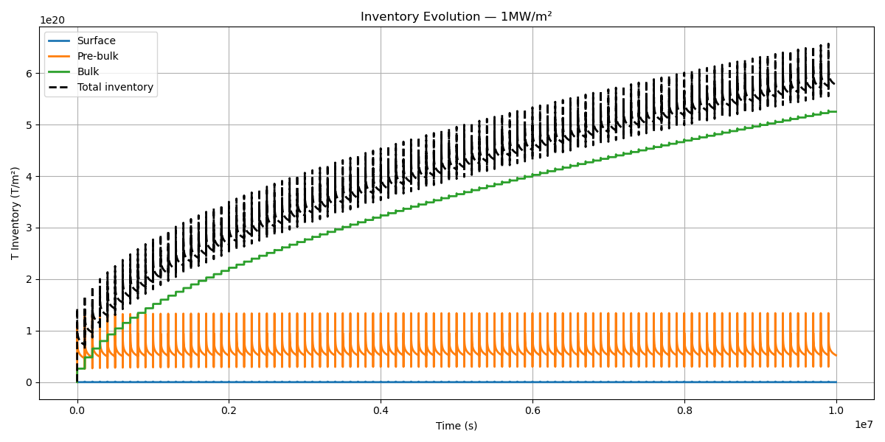

· **Run again a similar scheme of simulations as the ones done in FESTIM-1. We will run 100 consecutive simulations each of them consisting in a pulse of ~600 s followed by a waiting time of roughly 100,000s**.

o   Progress: Almost done

o   Comments: I already managed to restart simulations in FESTIM-2 but couldn't check if the initial conditions were correctly loaded and matched the output of the previous simulation. Right now I am setting up the script to run N consecutive simulations, loading the last profiles of the previous simulations as initial conditions. This will be made for the same 4 cases as before, considering heat loads of $10\hspace{2mm}MW/m^2,\hspace{2mm}1\hspace{2mm}MW/m^2,\hspace{2mm}500\hspace{2mm}kW/m^2\hspace{2mm}and\hspace{2mm}100\hspace{2mm}kW/m^2$. 

After checking the initial conditions are being load successfully and FESTIM is calculating and computing time-evolutions during waiting times (sometimes there is a bug in which instead of solving it just takes the previous timestep solution as a steady value), I ran 100 consecutive simulations for the previous case. As a additional validation the results of the inventory build-up and evolution over time were compared to those obtained with FESTIM-1:

Case 1, $Q=100 kW/m^2$:

.png)

Case 2, $Q=500 kW/m^2$:

Case 3, $Q=1 MW/m^2$:

.png)
Where the first images correspond to the results obtained with FESTIM-1 and the second ones to the results obtained with FESTIM-2.

I just got the results for the $1MW/m^2$ case but couldn't process them yet. For this purpose, the results shown with FESTIM-2 for the last case are corresponding to a heat flux of $900 kW/m^2$.