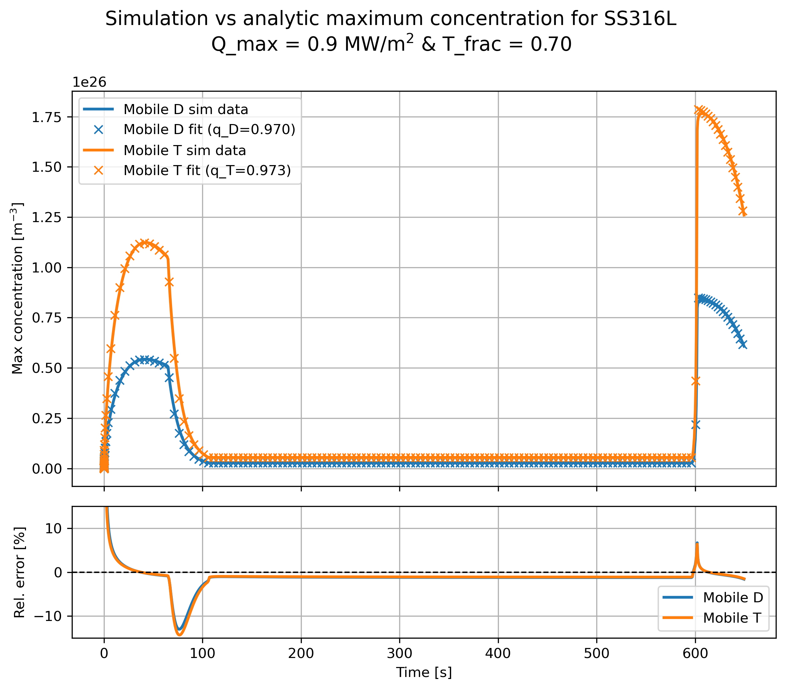
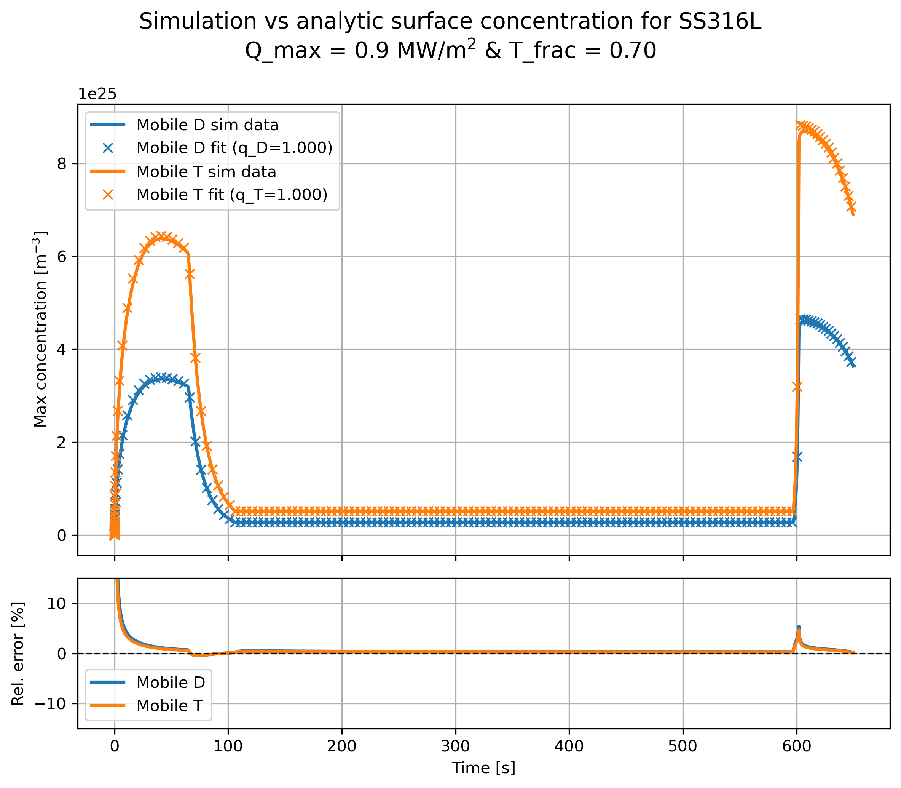

  **Try to analytically compute surface concentrations of mobile D and T from a fixed isotopic fraction in the plasma. Think how to implement this as a BC for slow recombination materials**.

o   Progress: Done

**Slow recombination and multiple isotopes:**

  For the case of multiple isotopes the previous approximations are not valid anymore. Let's assume we have an implantation flux with constant proportions of deuterium and tritium so that:
  
  $\phi_{imp}=\phi_D+\phi_T$,  and  $\phi_D=f\phi_{imp}$,   $\phi_T=(1-f)\phi_{imp}$.
  
  Notice that with two isotopes, the expressions for the recombination flux become:
  
$J_{{out},D}=2K_r c_{s,D}^2+K_r c_{s,D}c_{s,T}$ 

$J_{{out},T}=2K_r c_{s,T}^2+K_r c_{s,T}c_{s,D}$ 

Since recombination is slow, we can again consider that $J_{{out},D}=q_D\phi_D=q_D f\phi_{imp}$ and $J_{{out},T}=q_T(1-f)\phi_{imp}$. Where for the moment we can not assure that $q_D=q_T$. 
The new expressions for the recombination become:

$$J_{out,D}= q_D f\phi_{imp}=2K_r c_{s,D}^2+K_r c_{s,D}c_{s,T}                                 \hspace{32mm}(1)$$

 $$J_{{out},T}=q_T(1-f)\phi_{imp}=2K_r c_{s,T}^2+K_r c_{s,T}c_{s,D}\hspace{23mm}         (2)$$

From (1) we can isolate $c_{s,T}$ and obtain: 

   $c_{s,T}=\frac{q_Df\phi}{K_r c_{s,D}}-2c_{s,D}$

And plugging this expression into (2) we obtain a quartic equation on $c_{s,D}$:

$$6K_r c_{s,D}^4-(7q_D f\phi+q_T(1-f)\phi)c_{s,D}^2+\frac{2q_D^2f^2\phi^2}{K_r}=0$$

Once this equation is solved and we know $c_{s,D}$, we can compute $c_{s,T}$ and our new BCs would become:

$$c_{m,D}=\frac{q_D\phi f R_p}{D}+c_{s,D},      c_{m,T}=\frac{q_T\phi (1-f) R_p}{D}+c_{s,T}$$

Returning to the polynomial expression for $c_{s,D}$ , we can do a change of variables and set $x=c_{s,D}^2$ and also $z=\frac{q_T(1-f)}{q_D f}$. Applying the quadratic formula and solving for x we get:

$x=q_D f\phi\frac{7+z\pm\sqrt{1+14z+z^2}}{12K_r}$ and therefore $c_{s,D}=\sqrt{q_D f\phi\frac{7+z\pm\sqrt{1+14z+z^2}}{12K_r}}$

The final expression for $c_{m,D}$ becomes:

$c_{m,D}=\frac{q_D\phi f R_p}{D}+\sqrt{q_D f\phi\frac{7+z\pm\sqrt{1+14z+z^2}}{12K_r}}$

The main problem of this formula is that in order to solve it we need to know, or to fit with regards to simulation data, the values of $q_D$ and $q_T$. In order to simplify the problem, I assumed that $q_D=q_T$ (notice that since in our simulations we are using the same diffusion coefficients and energies, this is to be expected). This way, $z=\frac{1-f}{f}$ and each concentration depends now only on its own $q$. With this approximation, and considering the negative branch of the square root, 

$$c_{m,D}=\frac{q_D\phi f R_p}{D}+\sqrt{q_D f\phi\frac{7+z-\sqrt{1+14z+z^2}}{12K_r}}$$

$$c_{m,T}=\frac{q_T\phi (1-f) R_p}{D}+\sqrt{q_T (1-f)\phi\frac{7+y-\sqrt{1+14y+{y}^2}}{12K_r}}$$

where $y=\frac{1}{z}=\frac{f}{1-f}$, we found the best values for $q_D$ and $q_T$ so that our analytical expressions for $c_{m,D}$ and $c_{m,T}$ matched the simulation data:

 
 

We can see that the assumption that $q_D\approx q_T$ seems valid, as we obtained $q_D=0.970$ and $q_T=0.973$. Notice that our analytical expression is able to reproduce accurately the maximum concentration during the ramp-up, the flat-top and the ramp-down of the pulse, with relative errors exceeding 10% only during short periods of time.

The reason to choose the negative branch of the square root is that it is the only one with appropriate physical meaning. Notice that assuming $q_D$, $\phi$ and $K_r$ are fixed, we expect the surface concentration of deuterium to drop to zero as its fraction $f$ tends to zero. Moreover, we would expect $c_{s,D}$ to be proportional to $f$ when $f$ is close to zero:

$J_D=q_Df\phi=K_rc_{s,D}(2c_{s,D}+c_{s,T})\xrightarrow{f\to0}0\implies c_{s,D}\xrightarrow{f\to0}0\implies J_D=q_Df\phi\approx K_rc_{s,D}c_{s,T}$ 

Returning to our expression for $c_{s,D}$, and taking the limit when $f$ tends to zero:

$\lim_{f\to0}{c_{s,D}}=\lim_{f\to0}\sqrt{q_D f\phi\frac{7+z\pm\sqrt{1+14z+z^2}}{12K_r}}=\lim_{f\to0}\sqrt{\frac{q_D\phi}{12K_r}}\sqrt{7f+(1-f)\pm\sqrt{f^2+14f+(1-f)^2}}$

$=\lim_{f\to0}\sqrt{\frac{q_D\phi}{12K_r}}\sqrt{6f+1\pm\sqrt{2f^2+12f+1}}=\lim_{f\to0}\sqrt{\frac{q_D\phi}{12K_r}}\sqrt{6f+1\pm\sqrt{12f+1}}$

$=\lim_{f\to0}\sqrt{\frac{q_D\phi}{12K_r}}\sqrt{6f+1\pm(6f+1-18f^2)}$

where we took the second order Taylor expansion of the inner square root, and recall $z=\frac{1-f}{f}$. Finally, we can compute both branches of $c_{s,D}$:

$\lim_{f\to0}c_{s,D}^+=\sqrt{\frac{q_D\phi}{6K_r}}$

$\lim_{f\to0}c_{s,D}^-=\sqrt{\frac{q_D\phi}{12K_r}}\sqrt{18f^2}=f\sqrt{\frac{3q_D\phi}{2K_r}}$

Notice how the positive branch yields a constant non-zero surface concentration of Deuterium in the surface even when there is no Deuterium implantation flux, which does not make any physical sense. On the other hand, the negative branch of the square root predicts a Deuterium surface concentration depending linearly on $f$ when $f$ is small, as we expected.

Additionally, we can use this expression to estimate also Deuterium's maximum concentration. Recovering $J_D=q_Df\phi\approx K_rc_{s,D}c_{s,T}$ we can isolate $c_{s,T}=\frac{q_Df\phi}{K_rc_{s,D}}$ . Notice that this expression corresponds to the maximum Tritium surface concentration, as we are assuming that $f$ is close to zero. Substituting $c_{s,D}$ by the expression that we previously found: 

$c_{s,T}^{max}=\sqrt{\frac{2q_D\phi}{3K_r}}=c_{s,D}^{max}$  , since the system should be symmetric with respect the isotopic fractions.

Finally, using the negative branch of the square root to obtain the maximum Deuterium concentration (when $f$ tends to one) we obtain:

$c_{s,D}^{max}=\lim_{f\to1}\sqrt{q_D f\phi\frac{7+z-\sqrt{1+14z+z^2}}{12K_r}}=\sqrt{\frac{2q_D\phi}{3K_r}}$

exactly the same expression that we derived before, showing the consistency of our model and assumptions.

**Value of $q_D$ and $q_T$**

The values obtained for both $q_D$ and $q_T$ across a wide range of maximum heat loads and isotopic fractions were consistently very close to one (specifically between 0.97 and 0.99 ). Since there is no apparent way to easily predict the values of $q_D$ and $q_T$, we can further simplify the model assuming $q_D,q_T=1$ and compare the results obtained with these new expressions for $c_{m,D},c_{m,T}$: 

$$c_{m,D}=\frac{\phi f R_p}{D}+\sqrt{ f\phi\frac{7+z-\sqrt{1+14z+z^2}}{12K_r}}$$

$$c_{m,T}=\frac{\phi (1-f) R_p}{D}+\sqrt{ (1-f)\phi\frac{7+y-\sqrt{1+14y+{y}^2}}{12K_r}}$$

The results obtained are as good as the previous ones:

As we can see there is no significant difference in the results of the maximum concentration when taking $q_D,q_T=1$ than when we find the best $q_D,q_T$ by minimizing the sum of squared errors.

We can also compare the analytical expressions for the surface concentrations $c_{s,D},c_{s,T}$ with our simulation results:

Here we can see how during the flat-top, the real $q_D,q_T$ values are very close to but slightly lower than one:

.png)
Notice that this plot is very helpful to understand the different stages happening during the pulse. When $q_i<1$ it means that the recombination flux at the surface is lower than the implantation flux and, therefore, there is an inventory build-up of the isotope $i$. When $q_i=1$ , it means that the time derivative of the inventory is zero, that is, the recombination flux is exactly the same as the implantation flux. Finally, when $q_i>1$ it means that the time derivative of the inventory is actually negative, so the recombination flux at the surface is higher than the implantation flux, leading to hydrogen inventory depletion.