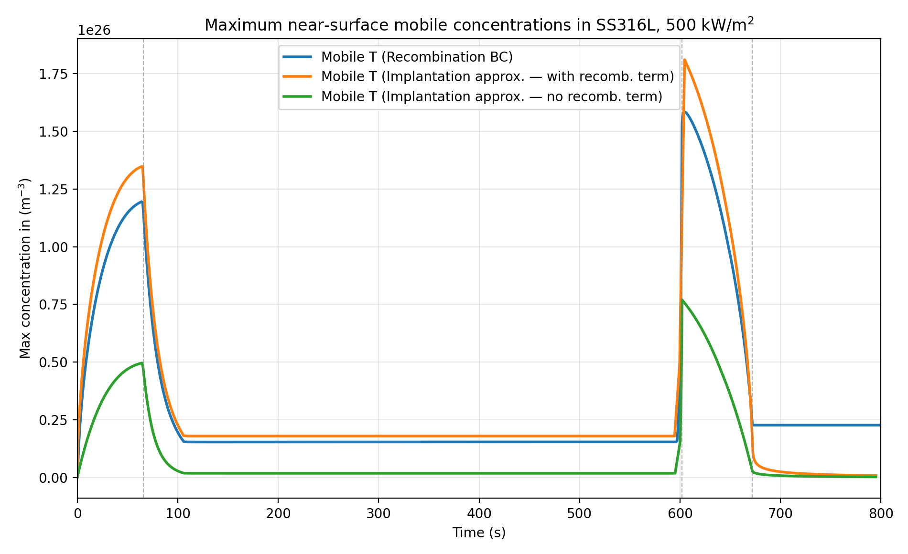
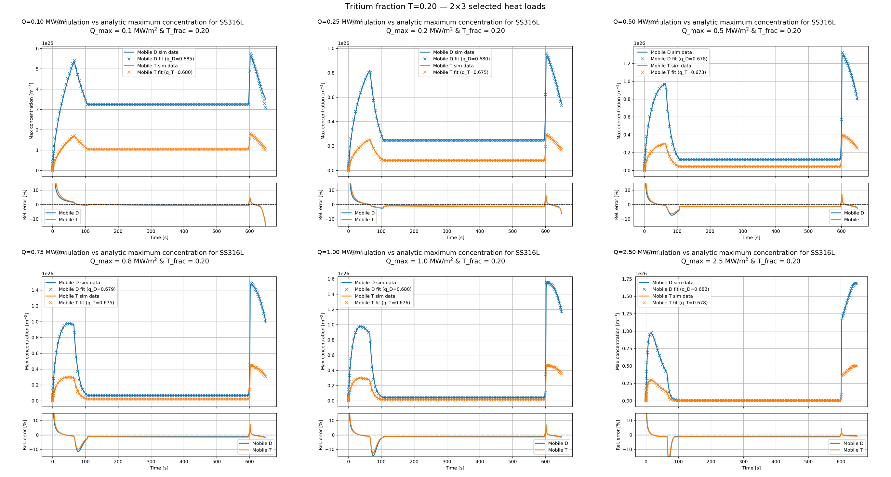
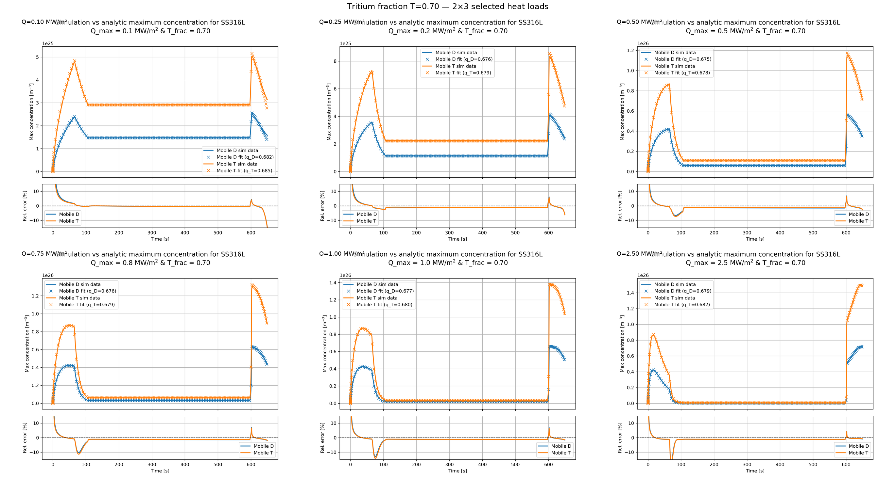
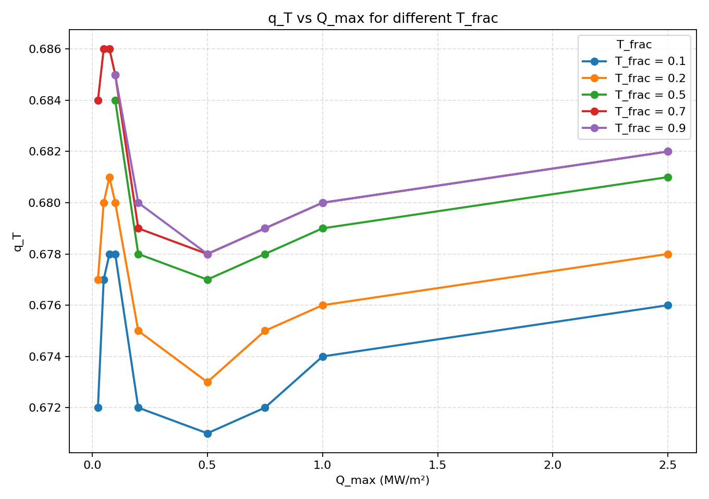
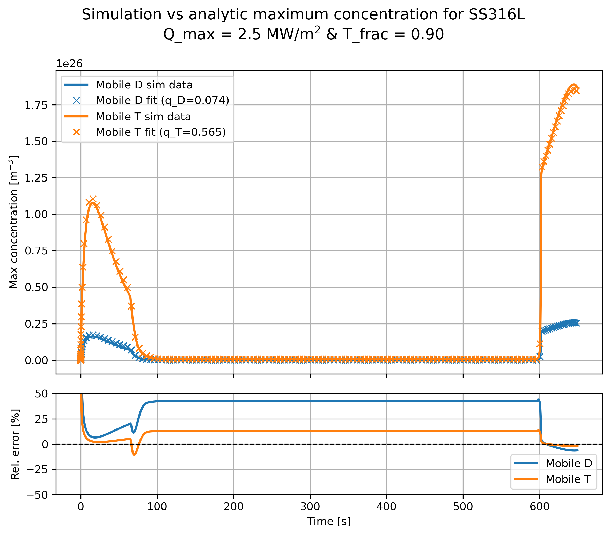
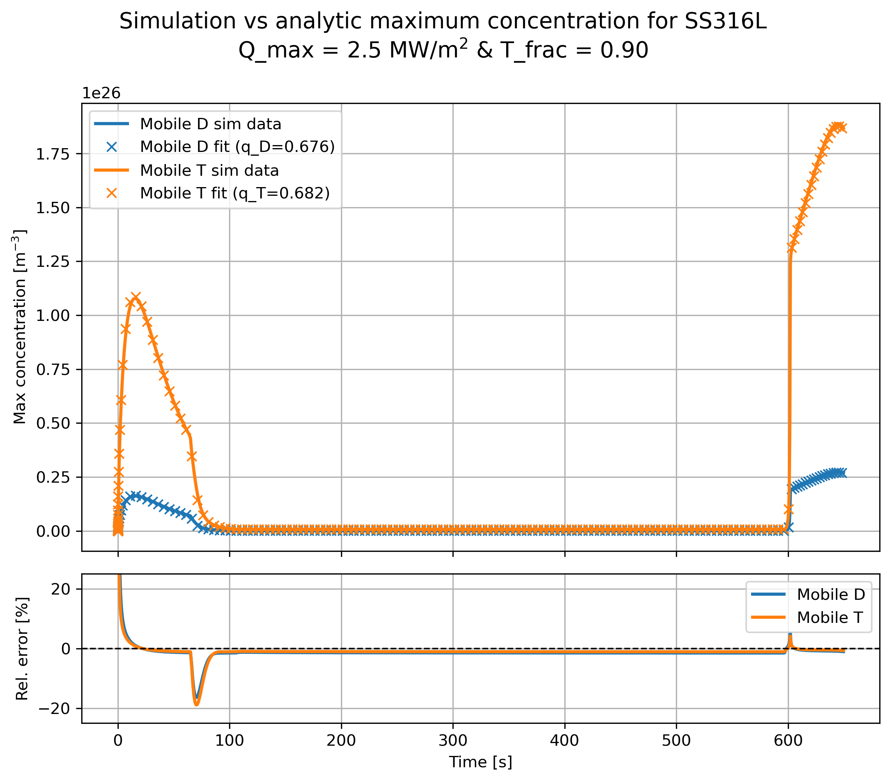
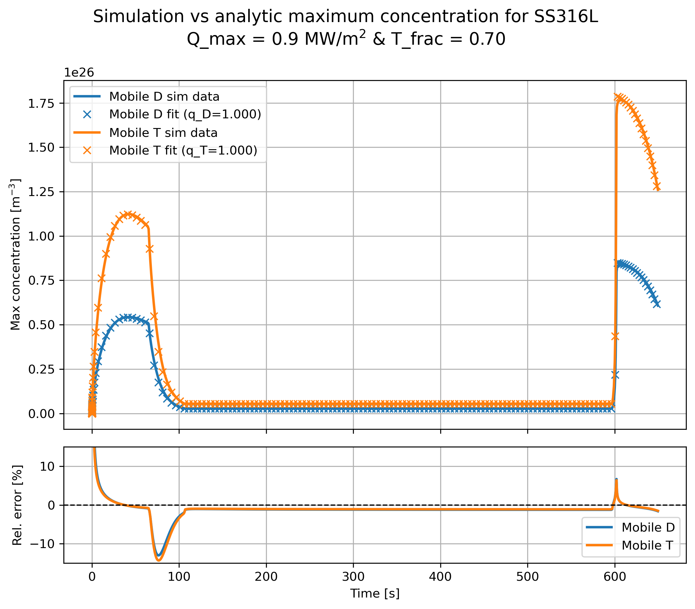

·    **Try to analytically compute surface concentrations of mobile D and T from a fixed isotopic fraction in the plasma. Think how to implement this as a BC for slow recombination materials**.

o   Progress: Done

o   Comments: Previously we saw that for SS316L, with a slow H surface recombination, the approximation for the maximum concentration of mobile H species, that we have been using for Tungsten, was not valid anymore. This previous approximation is:

$c_{m,D}=\frac{\phi_D R_p}{D}\hspace{1mm},\hspace{10mm} c_{m,T}=\frac{\phi_T R_p}{D}$ 

with $R_p$ being the average implantation range; $\phi_D=\phi\cdot f_D\hspace{1mm}$,  $\phi_T=\phi\cdot (1-f_D)\hspace{1mm}$ with $\phi$ being the total H implantation flux and $f_D$ the fraction of Deuterium in the plasma. Note that we are assuming all the plasma is composed of Deuterium and Tritium only. This approximation comes from two different assumptions:
1. Flux to the bulk is approximately zero $\rightarrow$ $\phi=J_{out}=D\frac{c_m-c_s}{R_p}$ 
2. Fast recombination or almost infinite recombination coefficient $K$: $J_{out}=K c_s^2\rightarrow c_s\approx0$ 
Finally we reach $\phi=D\frac{c_m}{R_p}$ or $c_m=\frac{\phi R_p}{D}$. 

Instead, if we assume that $c_s\neq0$:

$c_m=\frac{\phi R_p}{D}+\sqrt{\frac{\phi}{K}}$ 

After applying both approximations for the maximum concentration to SS316L and comparing them with the real results we observed that without the surface concentration term, the maximum concentration was very underestimated. On the other hand, adding that surface concentration term, the maximum concentration is overestimated:

Recall that the main assumption to derive this approximation is that $\phi_{Bulk}\approx0$ and therefore $\phi_{imp}\approx J_{out}$ . However, if the recombination is slow and we have higher surface concentrations, the difference between the implantation flux and the recombination flux at the surface is not neglectable, which makes the approximation not valid anymore.

**Slow recombination approximation:**

Instead, if we assume that the recombination is slow and the recombination flux is just a fraction of the total implantation flux, $J_{out}=q\hspace{1mm}\phi_{imp}$ we reach the following expression for the maximum concentration: $c_m=\frac{q\phi_{imp}R_p}{D}+\sqrt{\frac{q\phi}{K}}$ . 
After adding this $q$ factor in the previous SS316L case we obtained much better results:
 
 These results were obtained with $q=0.45$, that is, the recombination flux is a 45% of the total implantation flux. Despite showing improved results, what we are missing now is a way to predict or calculate the proper value for $q$. However, it can be useful to tune it manually after running one simulation with the recombination flux BC, so that we can run faster and more efficient simulations of similar cases in the future.  

**Slow recombination and multiple isotopes:**

  For the case of multiple isotopes the previous approximations are not valid anymore. Let's assume we have an implantation flux with constant proportions of deuterium and tritium so that:
  
  $\phi_{imp}=\phi_D+\phi_T$,  and  $\phi_D=f\phi_{imp}$,   $\phi_T=(1-f)\phi_{imp}$.
  
  Notice that with two isotopes, the expressions for the recombination flux become:
  
$J_{{out},D}=2K_r c_{s,D}^2+K_r c_{s,D}c_{s,T}$ 

$J_{{out},T}=2K_r c_{s,T}^2+K_r c_{s,T}c_{s,D}$ 

Since recombination is slow, we can again consider that $J_{{out},D}=q_D\phi_D=q_D f\phi_{imp}$ and $J_{{out},T}=q_T(1-f)\phi_{imp}$. Where for the moment we can not assure that $q_D=q_T$. 
The new expressions for the recombination become:

$$J_{out,D}= q_D f\phi_{imp}=2K_r c_{s,D}^2+K_r c_{s,D}c_{s,T}                                 \hspace{32mm}(1)$$

 $$J_{{out},T}=q_T(1-f)\phi_{imp}=2K_r c_{s,T}^2+K_r c_{s,T}c_{s,D}\hspace{23mm}         (2)$$

From (1) we can isolate $c_{s,T}$ and obtain: 

   $c_{s,T}=\frac{q_Df\phi}{K_r c_{s,D}}-2c_{s,D}$

And plugging this expression into (2) we obtain a quartic equation on $c_{s,D}$:

$$6K_r c_{s,D}^4-(7q_D f\phi+q_T(1-f)\phi)c_{s,D}^2+\frac{2q_D^2f^2\phi^2}{K_r}=0$$

Once this equation is solved and we know $c_{s,D}$, we can compute $c_{s,T}$ and our new BCs would become:

$$c_{m,D}=\frac{q_D\phi f R_p}{D}+c_{s,D},      c_{m,T}=\frac{q_T\phi (1-f) R_p}{D}+c_{s,T}$$

Returning to the polynomial expression for $c_{s,D}$ , we can do a change of variables and set $x=c_{s,D}^2$ and also $z=\frac{q_T(1-f)}{q_D f}$. Applying the quadratic formula and solving for x we get:

$x=q_D f\phi\frac{7+z\pm\sqrt{1+14z+z^2}}{12K_r}$ and therefore $c_{s,D}=\sqrt{q_D f\phi\frac{7+z\pm\sqrt{1+14z+z^2}}{12K_r}}$

The final expression for $c_{m,D}$ becomes:

$c_{m,D}=\frac{q_D\phi f R_p}{D}+\sqrt{q_D f\phi\frac{7+z\pm\sqrt{1+14z+z^2}}{12K_r}}$

The main problem of this formula is that in order to solve it we need to know, or to fit with regards to simulation data, the values of $q_D$ and $q_T$. In order to simplify the problem, I assumed that $q_D=q_T$ (notice that since in our simulations we are using the same diffusion coefficients and energies, this is to be expected). This way, $z=\frac{1-f}{f}$ and each concentration depends now only on its own $q$. With this approximation, and considering the negative branch of the square root, 

$$c_{m,D}=\frac{q_D\phi f R_p}{D}+\sqrt{q_D f\phi\frac{7+z-\sqrt{1+14z+z^2}}{12K_r}}$$

$$c_{m,T}=\frac{q_T\phi (1-f) R_p}{D}+\sqrt{q_T (1-f)\phi\frac{7+y-\sqrt{1+14y+{y}^2}}{12K_r}}$$

where $y=\frac{1}{z}=\frac{f}{1-f}$, we found the best values for $q_D$ and $q_T$ so that our analytical expressions for $c_{m,D}$ and $c_{m,T}$ matched the simulation data:

 

We can see that the assumption that $q_D\approx q_T$ seems valid, as we obtained $q_D=0.675$ and $q_T=0.678$. Notice that our analytical expression is able to reproduce accurately the maximum concentration during the ramp-up, the flat-top and the ramp-down of the pulse, with relative errors exceeding 5% during short periods of time.

The reason to choose the negative branch of the square root is that it is the only one with appropriate physical meaning. Notice that assuming $q_D$, $\phi$ and $K_r$ are fixed, we expect the surface concentration of deuterium to drop to zero as its fraction $f$ tends to zero. Moreover, we would expect $c_{s,D}$ to be proportional to $f$ when $f$ is close to zero:

$J_D=q_Df\phi=K_rc_{s,D}(2c_{s,D}+c_{s,T})\xrightarrow{f\to0}0\implies c_{s,D}\xrightarrow{f\to0}0\implies J_D=q_Df\phi\approx K_rc_{s,D}c_{s,T}$ 

Returning to our expression for $c_{s,D}$, and taking the limit when $f$ tends to zero:

$\lim_{f\to0}{c_{s,D}}=\lim_{f\to0}\sqrt{q_D f\phi\frac{7+z\pm\sqrt{1+14z+z^2}}{12K_r}}=\lim_{f\to0}\sqrt{\frac{q_D\phi}{12K_r}}\sqrt{7f+(1-f)\pm\sqrt{f^2+14f+(1-f)^2}}$

$=\lim_{f\to0}\sqrt{\frac{q_D\phi}{12K_r}}\sqrt{6f+1\pm\sqrt{2f^2+12f+1}}=\lim_{f\to0}\sqrt{\frac{q_D\phi}{12K_r}}\sqrt{6f+1\pm\sqrt{12f+1}}$

$=\lim_{f\to0}\sqrt{\frac{q_D\phi}{12K_r}}\sqrt{6f+1\pm(6f+1-18f^2)}$

where we took the second order Taylor expansion of the inner square root, and recall $z=\frac{1-f}{f}$. Finally, we can compute both branches of $c_{s,D}$:

$\lim_{f\to0}c_{s,D}^+=\sqrt{\frac{q_D\phi}{6K_r}}$

$\lim_{f\to0}c_{s,D}^-=\sqrt{\frac{q_D\phi}{12K_r}}\sqrt{18f^2}=f\sqrt{\frac{3q_D\phi}{2K_r}}$

Notice how the positive branch yields a constant non-zero surface concentration of Deuterium in the surface even when there is no Deuterium implantation flux, which does not make any physical sense. On the other hand, the negative branch of the square root predicts a Deuterium surface concentration depending linearly on $f$ when $f$ is small, as we expected.

Additionally, we can use this expression to estimate also Deuterium's maximum concentration. Recovering $J_D=q_Df\phi\approx K_rc_{s,D}c_{s,T}$ we can isolate $c_{s,T}=\frac{q_Df\phi}{K_rc_{s,D}}$ . Notice that this expression corresponds to the maximum Tritium surface concentration, as we are assuming that $f$ is close to zero. Substituting $c_{s,D}$ by the expression that we previously found: 

$c_{s,T}^{max}=\sqrt{\frac{2q_D\phi}{3K_r}}=c_{s,D}^{max}$  , since the system should be symmetric with respect the isotopic fractions.

Finally, using the negative branch of the square root to obtain the maximum Deuterium concentration (when $f$ tends to one) we obtain:

$c_{s,D}^{max}=\lim_{f\to1}\sqrt{q_D f\phi\frac{7+z-\sqrt{1+14z+z^2}}{12K_r}}=\sqrt{\frac{2q_D\phi}{3K_r}}$

exactly the same expression that we derived before, showing the consistency of our model and assumptions.

After running simulations of different scenarios, varying the maximum heat load and the Tritium fraction in the plasma, we saw that this model replicates well the maximum concentration in a wide range of scenarios:

We can also analyze how do $q_D$ and $q_T$ depend on the heat load and in the Tritium fraction in the plasma:

From this plot, it seems clear that the higher the isotope fraction in the plasma, the higher its $q$ value, which recall when it was first introduced it meant the ratio $\frac{\phi_{rec}}{\phi_{imp}}$ , that is, what fraction of the implanted H isotope is exiting the material due to recombination.

However, its dependency with the heat load is complex, and we would ideally like to predict $q$ from material parameters, isotopic fractions in the plasma and power level. It is also true that in these power ranges, the minimum and maximum $q_T$ values obtained are very similar, $q_{T,M}=0.686$, $q_{T,m}=0.671$, a relative difference of $2.2\%$. Therefore, using an average value of $q_T$ for all cases might provide results accurate enough.

One of the things that is left to study, is how do these $q_D,\hspace{1mm}q_T$ change after long-term operation, once there is a significant amount of trapped fuel in the material. In previous simulations we saw that the increment in bulk inventory per pulse is decreasing over time, so we probably would expect $q_D,\hspace{1mm}q_T$ to increase with time.

Example of surface concentrations and $q_D$, $q_T$ obtained using the positive branch of the square root:

Notice how $q_D$ is very close to zero since in order to reproduce the small D surface concentration for this case, when $f=0.1$. Despite the small $q_D$, the analytical value of $c_{s,D}$ is almost $50\%$ higher than the simulated one during the flat-top of the pulse. Tritium concentration shows lower relative error, but still significant, around $15\%$.

On the other hand, these are the results when taking the negative branch as the solution:

These results show consistently lower relative errors than before, very close to zero except for the steeper phases of the ramp-up and ramp-down. Additionally, it yields very similar values for $q_D$ 
and $q_T$, as expected.

**Explanation of the Discrepancy in $q$ Values** 

Initially, when comparing the analytical expressions for the maximum concentrations $c_{m,D} = \dfrac{q_D \phi f R_p}{D} + \sqrt{ q_D f \phi \, \dfrac{7+z-\sqrt{1+14z+z^2}}{12K_r} }$ and $c_{m,T} = \dfrac{q_T \phi (1-f) R_p}{D} + \sqrt{ q_T (1-f) \phi \, \dfrac{7+y-\sqrt{1+14y+y^2}}{12K_r} },$ 

to simulation results, the best-fit values for $q_D$ and $q_T$ were around $0.68$. This suggested that $q$ was significantly less than $1$.

**Manual Check of $q(t)$** 
To verify this, I manually computed $q(t)$ at each time step using the definition: $q(t) = 1 - \dfrac{\dfrac{dI}{dt}}{\phi(t)},$ where $I(t)$ is the total inventory and $\phi(t)$ is the implantation flux. The derivative $\dfrac{dI}{dt}$ was obtained numerically from the inventory evolution in the simulation. Surprisingly, this calculation showed that: $q(t) \approx 0.97 \text{ to } 0.99 \quad \text{almost everywhere}.$ 

**Final error** 
This discrepancy led me to inspect the simulation script, where I found that the implantation flux had been unintentionally scaled by a factor of $0.7$: $\phi_{\text{sim}} = 0.7 \, \phi.$ Because the analytical model used the correct flux $\phi$, the fitting procedure compensated for the lower simulated flux by reducing $q$: $q_{\text{fit}} \approx 0.68 \approx 0.7.$ 

**Corrected simulations and refit** 
After removing the scaling factor and re-running the simulations with: $\phi_{\text{sim}} = \phi,$ I applied the same fitting procedure (minimizing the sum of squared errors between analytical and simulated concentrations). The resulting best-fit values were: $q_D \approx q_T \approx 1.00,$ confirming that $q \approx 1$ is a valid assumption. 

**Impact on the Model** 
Since the term of the surface concentration depends on: $c_s \propto \sqrt{q},$ forcing $q = 1$ does not significantly degrade the accuracy of the analytical predictions. Therefore the model is further simplified and we can use the same equations described above with $q_D = q_T =1$:

$$c_{m,D}=\frac{\phi f R_p}{D}+\sqrt{ f\phi\frac{7+z-\sqrt{1+14z+z^2}}{12K_r}}$$

$$c_{m,T}=\frac{\phi (1-f) R_p}{D}+\sqrt{ (1-f)\phi\frac{7+y-\sqrt{1+14y+{y}^2}}{12K_r}}$$
The results obtained with this simpler model without need of computing or estimating any $q$ value are as good as the previous ones:

Aside from being able to take $q_D=q_T=1$, the previous analysis and derivations are valid, since no condition on $q$ was imposed (aside from being between zero and one). The justification of taking the negative branch of the square root and the minimum and maximum surface concentration expressions are correct and should be changed just by forcing $q_D,q_T=1$. 