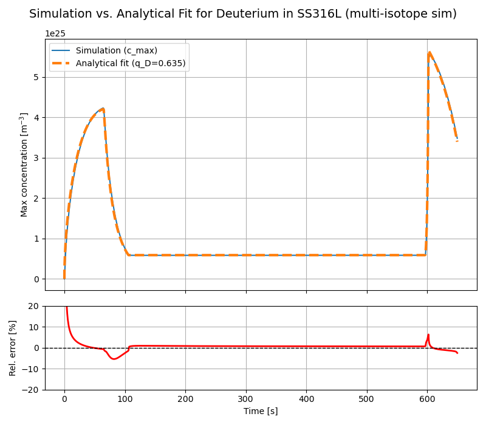
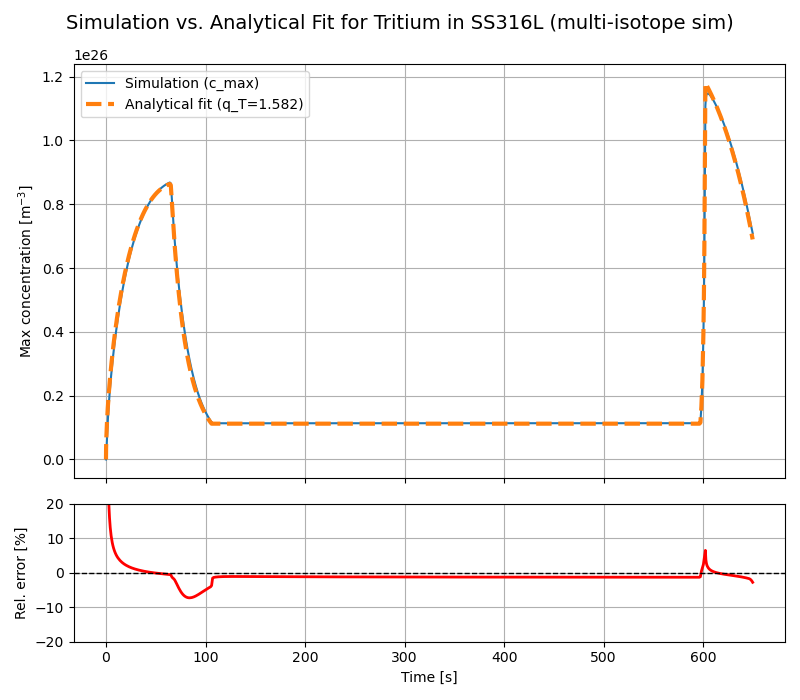

·    **Try to analytically compute surface concentrations of mobile D and T from a fixed isotopic fraction in the plasma. Think how to implement this as a BC for slow recombination materials**.

o   Progress: Ongoing

o   Comments: Previously we saw that for SS316L, with a slow H surface recombination, the approximation for the maximum concentration of mobile H species, that we have been using for Tungsten, was not valid anymore. This previous approximation is:

$c_{m,D}=\frac{\phi_D R_p}{D}\hspace{1mm},\hspace{10mm} c_{m,T}=\frac{\phi_T R_p}{D}$ 

with $R_p$ being the average implantation range; $\phi_D=\phi\cdot f_D\hspace{1mm}$,  $\phi_T=\phi\cdot (1-f_D)\hspace{1mm}$ with $\phi$ being the total H implantation flux and $f_D$ the fraction of Deuterium in the plasma. Note that we are assuming all the plasma is composed of Deuterium and Tritium only. This approximation comes from two different assumptions:
1. Flux to the bulk is approximately zero $\rightarrow$ $\phi=J_{out}=D\frac{c_m-c_s}{R_p}$ 
2. Fast recombination or almost infinite recombination coefficient $K$: $J_{out}=K c_s^2\rightarrow c_s\approx0$ 
Finally we reach $\phi=D\frac{c_m}{R_p}$ or $c_m=\frac{\phi R_p}{D}$. 

Instead, if we assume that $c_s\neq0$:

$c_m=\frac{\phi R_p}{D}+\sqrt{\frac{\phi}{K}}$ 

After applying both approximations for the maximum concentration to SS316L and comparing them with the real results we observed that without the surface concentration term, the maximum concentration was very underestimated. On the other hand, adding that surface concentration term, the maximum concentration is overestimated:

Recall that the main assumption to derive this approximation is that $\phi_{Bulk}\approx0$ and therefore $\phi_{imp}\approx J_{out}$ . However, if the recombination is slow and we have higher surface concentrations, the difference between the implantation flux and the recombination flux at the surface is not neglectable, which makes the approximation not valid anymore.

**Slow recombination approximation:**

Instead, if we assume that the recombination is slow and the recombination flux is just a fraction of the total implantation flux, $J_{out}=q\hspace{1mm}\phi_{imp}$ we reach the following expression for the maximum concentration: $c_m=\frac{q\phi_{imp}R_p}{D}+\sqrt{\frac{q\phi}{K}}$ . 
After adding this $q$ factor in the previous SS316L case we obtained much better results:
 
 These results were obtained with $q=0.45$, that is, the recombination flux is a 45% of the total implantation flux. Despite showing improved results, what we are missing now is a way to predict or calculate the proper value for $q$. However, it can be useful to tune it manually after running one simulation with the recombination flux BC, so that we can run faster and more efficient simulations of similar cases in the future.  

**Slow recombination and multiple isotopes:**

  For the case of multiple isotopes the previous approximations are not valid anymore. Let's assume we have an implantation flux with constant proportions of deuterium and tritium so that:
  
  $\phi_{imp}=\phi_D+\phi_T$,  and  $\phi_D=f\phi_{imp}$,   $\phi_T=(1-f)\phi_{imp}$.
  
  Notice that with two isotopes, the expressions for the recombination flux become:
  
$J_{{out},D}=2K_r c_{s,D}^2+K_r c_{s,D}c_{s,T}$ 

$J_{{out},T}=2K_r c_{s,T}^2+K_r c_{s,T}c_{s,D}$ 

Since recombination is slow, we can again consider that $J_{{out},D}=q_D\phi_D=q_D f\phi_{imp}$ and $J_{{out},T}=q_T(1-f)\phi_{imp}$. Where for the moment we can not assure that $q_D=q_T$. 
The new expressions for the recombination become:

$$J_{out,D}= q_D f\phi_{imp}=2K_r c_{s,D}^2+K_r c_{s,D}c_{s,T}                                 \hspace{32mm}(1)$$

 $$J_{{out},T}=q_T(1-f)\phi_{imp}=2K_r c_{s,T}^2+K_r c_{s,T}c_{s,D}\hspace{23mm}         (2)$$

From (1) we can isolate $c_{s,T}$ and obtain: 

   $c_{s,T}=\frac{q_Df\phi}{K_r c_{s,D}}-2c_{s,D}$

And plugging this expression into (2) we obtain a quartic equation on $c_{s,D}$:

$$6K_r c_{s,D}^4-(7q_D f\phi+q_T(1-f)\phi)c_{s,D}^2+\frac{2q_D^2f^2\phi^2}{K_r}=0$$

Once this equation is solved and we know $c_{s,D}$, we can compute $c_{s,T}$ and our new BCs would become:

$$c_{m,D}=\frac{q_D\phi f R_p}{D}+c_{s,D}$,      $c_{m,T}=\frac{q_T\phi (1-f) R_p}{D}+c_{s,T}$$

Returning to the polynomial expression for $c_{s,D}$ , we can do a change of variables and set $x=c_{s,D}^2$ and also $z=\frac{q_T(1-f)}{q_D f}$. Applying the quadratic formula and solving for x we get:

$x=q_D f\phi\frac{7+z\pm\sqrt{1+14z+z^2}}{12K_r}$ and therefore $c_{s,D}=\sqrt{q_D f\phi\frac{7+z\pm\sqrt{1+14z+z^2}}{12K_r}}$

The final expression for $c_{m,D}$ becomes:

$c_{m,D}=\frac{q_D\phi f R_p}{D}+\sqrt{q_D f\phi\frac{7+z\pm\sqrt{1+14z+z^2}}{12K_r}}$

The main problem of this formula is that in order to solve it we need to know, or to fit with regards to simulation data, the values of $q_D$ and $q_T$. In order to simplify the problem, we can assume that assuming $q_D=q_T$ will not result in significant difference in the surface concentrations. This way, $z^\prime=\frac{1-f}{f}$ and each concentration depends now only on its own $q$. With this approximation, and considering the positive branch of the square root, 

$$c_{m,D}=\frac{q_D\phi f R_p}{D}+\sqrt{q_D f\phi\frac{7+z^\prime+\sqrt{1+14z^\prime+{z^\prime}^2}}{12K_r}}$$

we replicated very well the maximum concentration with respect to the simulation data, for both D and T:

 

However, the assumption that we take for the surface concentration that $q_D\approx q_T$ has altered the physical meaning of $q$ and we get now values that are not directly the ratio $\frac{\phi_{rec,i}}{\phi_{imp,i}}$, notice that for instance we get $q_T=1.582$.

An interesting result that I still need to analyze deeper is the following:
If we assume fast recombination and no cross terms between different isotopes in the recombination equations, we obtain the same surface concentrations that we discussed before:
$c_{s,D}=\sqrt{\frac{\phi_D}{K_r}}$,     $c_{s,T}=\sqrt{\frac{\phi_T}{K_r}}$ . These would be the surface concentrations for fast recombination case in which the most dominant recomb. term is with its own isotope (which is not valid for SS316L and for very different isotope fractions in the plasma).

However, I found out that we get somewhat 'good' results if then we enforce the maximum concentrations of each isotope to be these surface concentrations:

.png)