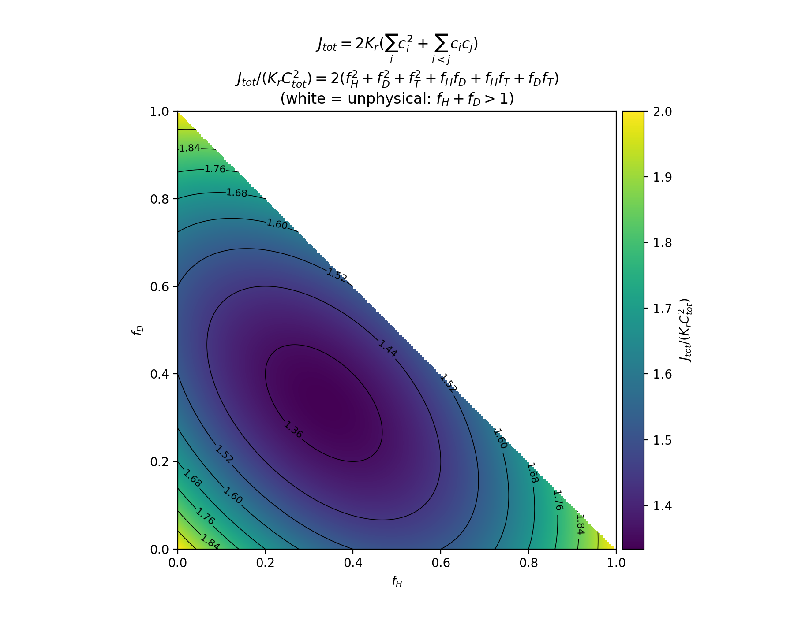

In this note I'm going to discuss two different models describing the Hydrogen isotopic recombination fluxes in terms of their surface concentrations.

**Model A: $J_{tot} = 2K_r\hspace{1mm}(\hspace{1mm}c_{s,H}+c_{s,D}+c_{s,T})^2$**

This model assumes any two H atoms can recombine with equal probability, regardless of the isotope. Therefore, the recombination flux depends in the number of possible pairs, which is proportional to the square of the total surface concentration. Expanding the formula we get

$J_{tot} = 2K_r\hspace{1mm}(c_{s,H}^2+c_{s,D}^2+c_{s,T}^2+2c_{s,H}c_{s,D}+2c_{s,H}c_{s,T}+2c_{s,D}c_{s,T})$

Where the $2$ multiplying the whole equation is counting two atoms lost per recombination event. The $2$s before the cross terms come from counting two types of recombination per isotope pair (HD and DH, HT and TH, DT and TD ). When splitting the total flux into isotopic fluxes we get:

$J_H = 2K_r\hspace{1mm}(c_{s,H}^2+c_{s,H}c_{s,D}+c_{s,H}c_{s,T})$

$J_D = 2K_r\hspace{1mm}(c_{s,D}^2+c_{s,D}c_{s,H}+c_{s,D}c_{s,T})$

$J_T = 2K_r\hspace{1mm}(c_{s,T}^2+c_{s,T}c_{s,H}+c_{s,T}c_{s,D})$

**Model B: Independent chemical channels**

This model starts assuming all possible chemical recombination reactions that can take place, each reaction rate is proportional to the product of the concentration of reactants. From the reaction rates we are able to recover isotopic fluxes.

$R_{HH}: H+H\rightarrow H_2$ with its associated reaction rate or molecular flux: $J_{HH}=K_rc_H^2$ 

and equivalently for D,  T: $J_{DD}=K_rc_D^2$,    $J_{TT}=K_rc_T^2$ 

For the different isotope recombination:

$J_{HD} = K_rc_{s,H}c_{s,D}$,     $J_{HT} = K_rc_{s,H}c_{s,T}$ ,     $J_{DT} = K_rc_{s,D}c_{s,T}$ 

We can now define the isotopic fluxes:

$J_{H} = 2J_{HH}+J_{HD}+J_{HT}$,    $J_{T} = 2J_{DD}+J_{HD}+J_{DT}$,    $J_{T} = 2J_{TT}+J_{HT}+J_{DT}$

since every reactions involving identical isotopes release two atoms. Instead, when the reaction involves different isotopes, one atom is released from each species. Finally we can compute the isotopic fluxes in term of surface concentrations:

$J_H = K_r\hspace{1mm}(2c_{s,H}^2+c_{s,H}c_{s,D}+c_{s,H}c_{s,T})$

$J_D = K_r\hspace{1mm}(2c_{s,D}^2+c_{s,D}c_{s,H}+c_{s,D}c_{s,T})$

$J_T = K_r\hspace{1mm}(2c_{s,T}^2+c_{s,T}c_{s,H}+c_{s,T}c_{s,D})$

This model is the one used in FESTIM when assigning surface recombination reactions as BCs. Notice that this model allows to consider different reaction rates for each chemical channel. However, even if all recombination coefficients and energies are taken as the same, the total atomic flux depends on isotopic fractions, being maximum when there is only one isotope and minimum when the multiple isotopes are evenly abundant:

I am trying to find literature regarding which model better represents reality. However, since **Model B** allows to define different recombination coefficients for each chemical reaction, and is the one being used by FESTIM, it seems reasonable to assume this is indeed the better model. 

**Model B** is the one that has been used throughout this section:
[Progress-tracker/Tritium inventory in PFC/Theory, models/Concentration BCs for slow recombination. Single and multi-isotopes.md at main · AdriaLlealS/Progress-tracker](https://github.com/AdriaLlealS/Progress-tracker/blob/main/Tritium%20inventory%20in%20PFC/Theory%2C%20models/Concentration%20BCs%20for%20slow%20recombination.%20Single%20and%20multi-isotopes.md)
