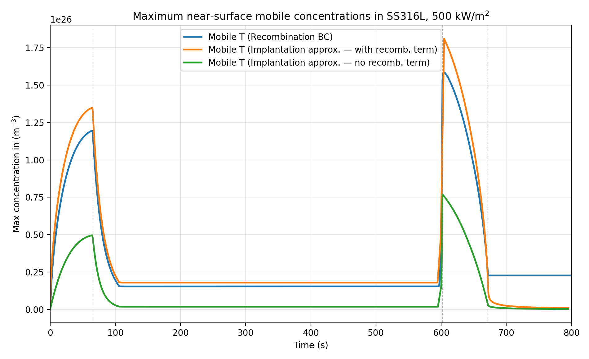

·    **With the current recombination coefficient of Hydrogen in SS316L, run simulations to study the validity of the implantation flux approximation**

o   Progress: Done

o   Comments: I found reliable values for Eurofer97 recombination and dissociation rates:

[Permeation and trapping of hydrogen in Eurofer97 - ScienceDirect](https://www.sciencedirect.com/science/article/pii/S2352179121001290)

These coefficients are ~10-12 orders of magnitude lower than for tungsten, therefore they should be taking into account in the flux implantation approximation, since the assumption $K \to \infty$ will probably not be valid anymore. Right now I am setting up simple hydrogen transport simulations in steel in order to compare maximum near-surface mobile concentrations with those predicted by the implantation flux approximation (both ignoring recombination and taking it into account.) 

Finally I have run simulations with the material parameters of SS316L, corresponding to the stainless steel chosen for ITER's diagnostic's first wall. The recombination coefficient is orders of magnitude larger than the one found for Eurofer97:

$K_r = 1.75 \cdot 10^{-24} \hspace{2mm} m^4/s$  ,   $E_{K_r} = 0.594 \hspace{2mm} eV$

I ran three different simulations of T retention in SS316L during a plasma pulse:
	- Implantation flux modeled as a gaussian source and surface recombination as a BC (with the previous parameters).
	- Surface concentration given to the  code as a BC using the implantation flux approximation (assuming fast recombination or $K \to \infty$):  $c_s = \frac{\phi_{imp}\hspace{1mm}R_p}{D}$
	- Surface concentration given to the  code as a BC using the implantation flux approximation (without the assumption of fast recombination):  $c_s = \frac{\phi_{imp}\hspace{1mm}R_p}{D}\hspace{2mm}+\hspace{2mm}\sqrt{\frac{\phi_{imp}}{K_r}}$

The results show that as opposed to tungsten, whose recombination is coefficient is orders of magnitude larger, considering a fast recombination in SS316L leads to much lower mobile concentrations in the surface and underestimates Hydrogen implantation in the material. 

When adding the second term in the imp. flux approximation, mobile concentrations were much closer to the real ones. However, in this case the approximation resulted in a slight overestimation of the Hydrogen implantation.